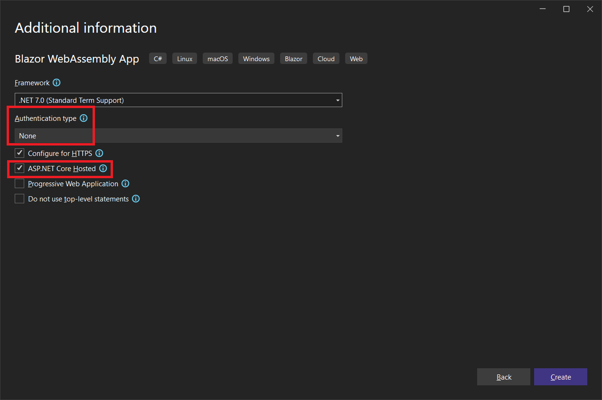
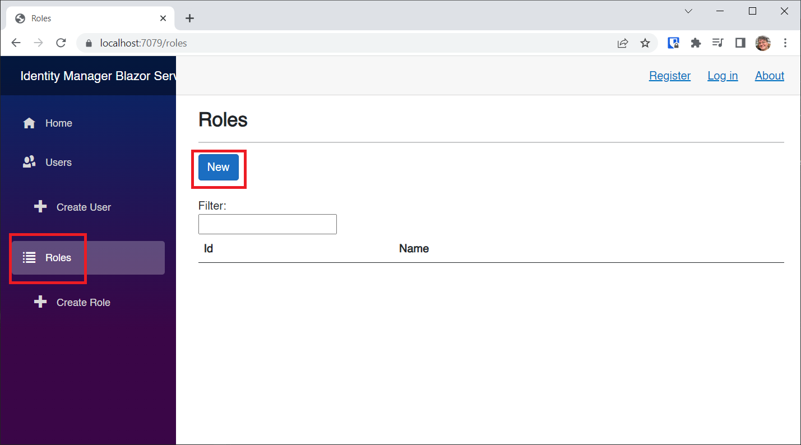
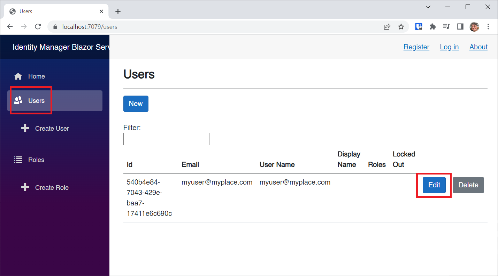

# Adding Identity to Blazor WebAssembly

In this module I'll show you how to get basic authentication and authorization working for an existing Blazor WebAssembly application using the **ASP.NET Core Identity** subsystem. I'll show you how to authorize markup, entire pages, and even code actions based on roles. I'll also show you how to manage roles for users.

## Prerequisites

The following prerequisites are needed for this demo.

### .NET 7.0

.NET 7 is installed with Visual Studio, but you can always download the latest version of the .NET 7.0 SDK [here](https://dotnet.microsoft.com/en-us/download).

### Visual Studio 2022

For this demo, we are going to use the latest version of [Visual Studio 2022](https://visualstudio.microsoft.com/vs/community/). 

## Definitions:

**Authentication**: The process of confirming that a user is the person that they say they are. The user is represented by an *Identity*.

**Authorization**: Now that we know the user's *Identity*, what are we going to allow them to do? Authorization is allowing the user to access aspects of your application based on their *Identity*, and the roles or claims they present.

**Role**: A *Role* is simply a name, like *admin*, *supervisor*, or *content_manager*. You can assign users to one or more roles, and then check those roles at runtime to authorize the user to do or see an aspect of the application. We will use roles in this module.

**Claim**: A *Claim* is an assertion by the user, such as their *name*, or *email address*. It can also be very specific to an aspect of the application, such as "canClickTheCounterButton". A *Claim* is like a *Role*, but more specific to the action they want to perform or the aspect they want to access. Claims are being favored over roles, but role-based authentication is still very useful and very powerful.

There are many ways to do authentication and authorization in a Blazor WebAssembly application. 

We are going to use the **ASP.NET Core Identity** subsystem including support for roles.

The default Blazor WebAssembly template does not include support for Identity, but we are going to add everything needed to generate an identity database, a standard schema used by the ASP.NET Core Identity subsystem. Well, almost everything. 

When we're done, our Blazor WebAssembly application will allow users to register, log in, and log out. We can then authorize sections of markup, entire pages, and even code, based on whether or not the user is authenticated and what roles they are in. 

In order to create roles and assign them to users, we'll need a little [helper application](https://github.com/carlfranklin/IdentityManagerLibrary) which I've already written and discussed in [BlazorTrain episode 84, Identity Management](https://www.youtube.com/watch?v=Q0dMdQtQduc).

## Demo

Create a new **Blazor WebAssembly App** project called **AddIdentityWasm**.


Be sure to not select an **Authentication Type**, and to select **ASP.NET Core Hosted**.



## Server-Side Config

Add the following to the *AddIdentityWasm.Server.csproj* file:

```xml
<ItemGroup>
    <PackageReference Include="Microsoft.AspNetCore.Diagnostics.EntityFrameworkCore" Version="7.0.9" />
    <PackageReference Include="Microsoft.AspNetCore.Identity.EntityFrameworkCore" Version="7.0.9" />
    <PackageReference Include="Microsoft.AspNetCore.Identity.UI" Version="7.0.9" />
    <PackageReference Include="Microsoft.AspNetCore.ApiAuthorization.IdentityServer" Version="7.0.9" />
    <PackageReference Include="Microsoft.EntityFrameworkCore.SqlServer" Version="7.0.9" />
    <PackageReference Include="Microsoft.EntityFrameworkCore.Tools" Version="7.0.9" />
</ItemGroup>
```

### No Scaffolding

Visual Studio has a scaffolding wizard for adding ASP.NET Core Identity features. However, as of this writing (Mid-July 2023) the scaffold-generated code has not caught up to what's in the Blazor WebAssembly  template with **Individual Accounts**. Rather than use the scaffolding wizard, I'm going to give you all the little pieces that you can add to an existing project. 

Add the following sections to the *appsettings.json* file:

```json
"ConnectionStrings": {
    "DefaultConnection": "Server=(localdb)\\mssqllocaldb;Database=AddIdentityWasm;Trusted_Connection=True;MultipleActiveResultSets=true"
},
"IdentityServer": {
    "Clients": {
      "AddIdentityWasm.Client": {
        "Profile": "IdentityServerSPA"
      }
    }
}
```

> :point_up: Note: in the real world, you would replace **AddIdentityWasm** with your solution name, and change the connection string accordingly. 

Add the following to *appsettings.Development.json*:

```json
"IdentityServer": {
    "Key": {
      "Type": "Development"
    }
  }
```

Go back to the *AddIdentityWasm.Server.csproj* file and add the database name as a `<UserSecretId>` to the top `<PropertyGroup>`.

```xml
<UserSecretsId>AddIdentityWasm</UserSecretsId>
```

To the **AddIdentityWasm.Server** project, create a *Models* folder, and add the following:

*ApplicationUser.cs*:

```c#
using Microsoft.AspNetCore.Identity;

namespace AddIdentityWasm.Server.Models;

public class ApplicationUser : IdentityUser
{
}
```

Add a *Data* folder, and add the following:

*ApplicationDbContext.cs*:

```c#
using AddIdentityWasm.Server.Models;
using Duende.IdentityServer.EntityFramework.Options;
using Microsoft.AspNetCore.ApiAuthorization.IdentityServer;
using Microsoft.EntityFrameworkCore;
using Microsoft.Extensions.Options;

namespace AddIdentityWasm.Server.Data;

public class ApplicationDbContext : ApiAuthorizationDbContext<ApplicationUser>
{
    public ApplicationDbContext(
        DbContextOptions options,
        IOptions<OperationalStoreOptions> operationalStoreOptions) : base(options, operationalStoreOptions)
    {
    }
}
```

Add the following to *Program.cs* above the line `builder.Services.AddControllersWithViews();`:

```c#
var connectionString = builder.Configuration.GetConnectionString("DefaultConnection") ?? throw new InvalidOperationException("Connection string 'DefaultConnection' not found.");
builder.Services.AddDbContext<ApplicationDbContext>(options =>
    options.UseSqlServer(connectionString));

builder.Services.AddDatabaseDeveloperPageExceptionFilter();

builder.Services.AddDefaultIdentity<ApplicationUser>(options => options.SignIn.RequireConfirmedAccount = true)
    .AddRoles<IdentityRole>() // Use roles
    .AddEntityFrameworkStores<ApplicationDbContext>();

builder.Services.AddIdentityServer()
    .AddApiAuthorization<ApplicationUser, ApplicationDbContext>(options => {
        options.IdentityResources["openid"].UserClaims.Add("name");
        options.ApiResources.Single().UserClaims.Add("name");
        options.IdentityResources["openid"].UserClaims.Add("role");
        options.ApiResources.Single().UserClaims.Add("role");
    });

JwtSecurityTokenHandler.DefaultInboundClaimTypeMap.Remove("role");

builder.Services.AddAuthentication()
    .AddIdentityServerJwt();
```

You'll need these:

```c#
using AddIdentityWasm.Server.Data;
using AddIdentityWasm.Server.Models;
using Microsoft.AspNetCore.Authentication;
using Microsoft.AspNetCore.Identity;
using Microsoft.EntityFrameworkCore;
using System.IdentityModel.Tokens.Jwt;
```

Add the following after the line `app.UseRouting();`:

```c#
app.UseIdentityServer();
app.UseAuthorization();
```

Add the following line inside the condition `if (app.Environment.IsDevelopment())`:

```c#
app.UseMigrationsEndPoint();
```

Build the solution before continuing to the next step.

Open the Package Manager window, and make sure to select **AddIdentityWasm.Server** as the default project:


Generate the database script code by executing the following command:

```
add-migration CreateIdentitySchema
```

Now you will notice a new folder called *Migrations*, and two classes that were generated to support creating the database.


Create the database by executing the following command:

```
update-database
```

When complete, open the **SQL Server Object Explorer** and expand **MSSQLLocalDb**, and then **Databases**. You'll see the **AddIdentityWasm** database listed.


Add the following to the *Controllers* folder:

*OidcConfigurationController.cs*:

```c#
using Microsoft.AspNetCore.ApiAuthorization.IdentityServer;
using Microsoft.AspNetCore.Mvc;

namespace AddIdentityWasm.Server.Controllers;

public class OidcConfigurationController : Controller
{
    private readonly ILogger<OidcConfigurationController> _logger;

    public OidcConfigurationController(IClientRequestParametersProvider clientRequestParametersProvider, ILogger<OidcConfigurationController> logger)
    {
        ClientRequestParametersProvider = clientRequestParametersProvider;
        _logger = logger;
    }

    public IClientRequestParametersProvider ClientRequestParametersProvider { get; }

    [HttpGet("_configuration/{clientId}")]
    public IActionResult GetClientRequestParameters([FromRoute] string clientId)
    {
        var parameters = ClientRequestParametersProvider.GetClientParameters(HttpContext, clientId);
        return Ok(parameters);
    }
}
```

Create a folder tree - *Areas\Identity\Pages\Shared* - and then add the following:

*_LoginPartial.cshtml*:

```html
@using Microsoft.AspNetCore.Identity
@using AddIdentityWasm.Server.Models
@inject SignInManager<ApplicationUser> SignInManager
@inject UserManager<ApplicationUser> UserManager
@addTagHelper *, Microsoft.AspNetCore.Mvc.TagHelpers

@{
    var returnUrl = "/";
    if (Context.Request.Query.TryGetValue("returnUrl", out var existingUrl)) {
        returnUrl = existingUrl;
    }
}

<ul class="navbar-nav">
@if (SignInManager.IsSignedIn(User))
{
    <li class="nav-item">
        <a  class="nav-link text-dark" asp-area="Identity" asp-page="/Account/Manage/Index" title="Manage">Hello @User.Identity?.Name!</a>
    </li>
    <li class="nav-item">
        <form class="form-inline" asp-area="Identity" asp-page="/Account/Logout" asp-route-returnUrl="/" method="post">
            <button  type="submit" class="nav-link btn btn-link text-dark">Logout</button>
        </form>
    </li>
}
else
{
    <li class="nav-item">
        <a class="nav-link text-dark" asp-area="Identity" asp-page="/Account/Register" asp-route-returnUrl="@returnUrl">Register</a>
    </li>
    <li class="nav-item">
        <a class="nav-link text-dark" asp-area="Identity" asp-page="/Account/Login" asp-route-returnUrl="@returnUrl">Login</a>
    </li>
}
</ul>
```


## Client-Side Config

Add the following to the *AddIdentityWasm.Client.csproj* file:

```xml
<ItemGroup>
    <PackageReference Include="Microsoft.AspNetCore.Components.WebAssembly.Authentication" Version="7.0.9" />
    <PackageReference Include="Microsoft.Extensions.Http" Version="7.0.0" />
</ItemGroup>
```

Add the following to *wwwroot\index.html* right before the `</body>` end tag:

```html
<script src="_content/Microsoft.AspNetCore.Components.WebAssembly.Authentication/AuthenticationService.js"></script>
```

Add the following to *_Imports.razor*:

```
@using Microsoft.AspNetCore.Components.Authorization
@using Microsoft.AspNetCore.Authorization
```

Build the solution before continuing on.

Replace *App.razor* with the following:

```xml
<CascadingAuthenticationState>
    <Router AppAssembly="@typeof(App).Assembly">
        <Found Context="routeData">
            <AuthorizeRouteView RouteData="@routeData" DefaultLayout="@typeof(MainLayout)">
                <NotAuthorized>
                    @if (context.User.Identity?.IsAuthenticated != true)
                    {
                        <RedirectToLogin />
                    }
                    else
                    {
                        <p role="alert">You are not authorized to access this resource.</p>
                    }
                </NotAuthorized>
            </AuthorizeRouteView>
            <FocusOnNavigate RouteData="@routeData" Selector="h1" />
        </Found>
        <NotFound>
            <PageTitle>Not found</PageTitle>
            <LayoutView Layout="@typeof(MainLayout)">
                <p role="alert">Sorry, there's nothing at this address.</p>
            </LayoutView>
        </NotFound>
    </Router>
</CascadingAuthenticationState>

```

The three main changes we made were

1. Changing the `RouteView` component to an `AuthorizeRouteView` component
2. Wrapping the `Router` component in a `CascadingAuthenticationState` component.
3. Implementing code to redirect the user to the login page if they are not logged in and try to access a resource that requires authentication.

Add the following to the *Shared* folder:

*RedirectToLogin.razor*:

```c#
@using Microsoft.AspNetCore.Components.WebAssembly.Authentication
@inject NavigationManager Navigation

@code {
    protected override void OnInitialized()
    {
        Navigation.NavigateToLogin("authentication/login");
    }
}
```

*LoginDisplay.razor*:

```xml
@using Microsoft.AspNetCore.Components.Authorization
@using Microsoft.AspNetCore.Components.WebAssembly.Authentication
@inject NavigationManager Navigation

<AuthorizeView>
    <Authorized>
        <a href="authentication/profile">Hello, @context.User.Identity?.Name!</a>
        <button class="nav-link btn btn-link" @onclick="BeginLogOut">Log out</button>
    </Authorized>
    <NotAuthorized>
        <a href="authentication/register">Register</a>
        <a href="authentication/login">Log in</a>
    </NotAuthorized>
</AuthorizeView>

@code{
    private void BeginLogOut()
    {
        Navigation.NavigateToLogout("authentication/logout");
    }
}
```

This shows our login status, and gives us links for registering, logging in, and logging out.  This file would get added if we selected **Individual Accounts** when creating the project in Visual Studio.

add `<LoginDisplay />` to *Shared\MainLayout.razor* like so:

```xml
@inherits LayoutComponentBase

<div class="page">
    <div class="sidebar">
        <NavMenu />
    </div>

    <main>
        <div class="top-row px-4 auth">
            <LoginDisplay />
            <a href="https://docs.microsoft.com/aspnet/" target="_blank">About</a>
        </div>

        <article class="content px-4">
            @Body
        </article>
    </main>
</div>
```

Add the following class to the client project:

*CustomUserFactory.cs*:

```c#
namespace AddIdentityWasm.Client;
using System.Security.Claims;
using System.Text.Json;
using Microsoft.AspNetCore.Components.WebAssembly.Authentication;
using Microsoft.AspNetCore.Components.WebAssembly.Authentication.Internal;

public class CustomUserFactory
    : AccountClaimsPrincipalFactory<RemoteUserAccount>
{
    public CustomUserFactory(IAccessTokenProviderAccessor accessor)
        : base(accessor)
    {
    }

    public override async ValueTask<ClaimsPrincipal> CreateUserAsync(
        RemoteUserAccount account,
        RemoteAuthenticationUserOptions options)
    {
        var user = await base.CreateUserAsync(account, options);

        if (user.Identity is not null && user.Identity.IsAuthenticated)
        {
            var identity = (ClaimsIdentity)user.Identity;
            var roleClaims = identity.FindAll(identity.RoleClaimType).ToArray();

            if (roleClaims.Any())
            {
                foreach (var existingClaim in roleClaims)
                {
                    identity.RemoveClaim(existingClaim);
                }

                var rolesElem =
                    account.AdditionalProperties[identity.RoleClaimType];

                if (options.RoleClaim is not null && rolesElem is JsonElement roles)
                {
                    if (roles.ValueKind == JsonValueKind.Array)
                    {
                        foreach (var role in roles.EnumerateArray())
                        {
                            var roleValue = role.GetString();

                            if (!string.IsNullOrEmpty(roleValue))
                            {
                                identity.AddClaim(
                                  new Claim(options.RoleClaim, roleValue));
                            }

                        }
                    }
                    else
                    {
                        var roleValue = roles.GetString();

                        if (!string.IsNullOrEmpty(roleValue))
                        {
                            identity.AddClaim(
                              new Claim(options.RoleClaim, roleValue));
                        }
                    }
                }
            }
        }

        return user;
    }
}
```

This ensures we can access the **name** and **role** claims on the client side.

In the *Program.cs* file, locate this line where an `HttpClient` is created:

```c#
builder.Services.AddScoped(sp => new HttpClient { BaseAddress = new Uri(builder.HostEnvironment.BaseAddress) });
```

Replace it with the following:

```c#
builder.Services.AddHttpClient("AddIdentityWasm.ServerAPI", client => client.BaseAddress = new Uri(builder.HostEnvironment.BaseAddress))
    .AddHttpMessageHandler<BaseAddressAuthorizationMessageHandler>();

// Supply HttpClient instances that include access tokens when making requests to the server project
builder.Services.AddScoped(sp => sp.GetRequiredService<IHttpClientFactory>().CreateClient("AddIdentityWasm.ServerAPI"));

builder.Services.AddApiAuthorization()
    .AddAccountClaimsPrincipalFactory<CustomUserFactory>();
```

Add the following to the *Pages* folder:

*Authentication.razor*:

```xml
@page "/authentication/{action}"
@using Microsoft.AspNetCore.Components.WebAssembly.Authentication
<RemoteAuthenticatorView Action="@Action" />

@code{
    [Parameter] public string? Action { get; set; }
}
```

### Authorization

Authorization happens in the Client app.

Let's start by doing a little authorization of markup.

Replace *\Shared\NavMenu.razor* with the following:

```c#
<div class="top-row ps-3 navbar navbar-dark">
    <div class="container-fluid">
        <a class="navbar-brand" href="">AddIdentityWasm</a>
        <button title="Navigation menu" class="navbar-toggler" @onclick="ToggleNavMenu">
            <span class="navbar-toggler-icon"></span>
        </button>
    </div>
</div>

<div class="@NavMenuCssClass nav-scrollable" @onclick="ToggleNavMenu">
    <nav class="flex-column">
        <div class="nav-item px-3">
            <NavLink class="nav-link" href="" Match="NavLinkMatch.All">
                <span class="oi oi-home" aria-hidden="true"></span> Home
            </NavLink>
        </div>
        <AuthorizeView>
            <div class="nav-item px-3">
                <NavLink class="nav-link" href="counter">
                    <span class="oi oi-plus" aria-hidden="true"></span> Counter
                </NavLink>
            </div>
        </AuthorizeView>
        <AuthorizeView Roles="admin">
            <div class="nav-item px-3">
                <NavLink class="nav-link" href="fetchdata">
                    <span class="oi oi-list-rich" aria-hidden="true"></span> Fetch data
                </NavLink>
            </div>
        </AuthorizeView>
    </nav>
</div>

@code {
    private bool collapseNavMenu = true;

    private string? NavMenuCssClass => collapseNavMenu ? "collapse" : null;

    private void ToggleNavMenu()
    {
        collapseNavMenu = !collapseNavMenu;
    }
}
```

You can see that I've enclosed the `NavLink` to **Counter** in an `<AuthorizeView>` component:

```xml
<AuthorizeView>
    <div class="nav-item px-3">
        <NavLink class="nav-link" href="counter">
            <span class="oi oi-plus" aria-hidden="true"></span> Counter
        </NavLink>
    </div>
</AuthorizeView>
```

This means the user must be authenticated (logged in) before they can see that `NavLink`.

Also, look at the `<AuthorizeView>` I put around the link to the **FetchData** `NavLink`:

```xml
<AuthorizeView Roles="admin">
    <div class="nav-item px-3">
        <NavLink class="nav-link" href="fetchdata">
            <span class="oi oi-list-rich" aria-hidden="true"></span> Fetch data
        </NavLink>
    </div>
</AuthorizeView>
```

Not only does the user need to be logged in to see this `NavLink`, but they must be in the **admin** role. More on roles later. 

> :point_up: You can use `<AuthorizeView>` around any bit of markup in any component or page to restrict it.

Run the app to ensure we can't see these `NavLink`s:


However, you should note that the user can still use the **Counter** and **FetchData** pages just by specifying the route in the URL:


This is possible because we only restricted the `NavLink` objects. In order to really secure the app, we will need to restrict those pages. More on that in a few minutes.

Click the **Register** link in the top-right. You'll be presented with a screen that looks like this:


Enter a user name and password. It doesn't have to be elaborate, but it does have to meet the basic password requirements. This is your private database on your local machine. My password is "P@ssword1".

Click the **Register** button and you'll be asked to click on a link in order to confirm your account.

This is a shortcut because you don't have an email sender registered, so the app can't do an email verification.


Once you click this link, you can look in the **dbo.AspNetUsers** table, and see that the **EmailConfirmed** field in your user record has been set to *True*. If you do not do this, authentication will fail.


After successfully registering, you can log in.

Now you can see that the `NavLink` for the **Counter** page is enabled, but the **FetchData** `NavLink` is still not showing. That's because we require the user to be in the **admin** role, remember?


However, we can still navigate to the **FetchData** page by specifying the route:


Let's button up our two authorized pages now.

Add the following to *Counter.razor* at line 2:

```c#
@attribute [Authorize]
```

This will require the user to be authenticated (logged in) in order to see the page.

Add this to *FetchData.razor* at line 2:

```c#
@attribute [Authorize(Roles = "admin")]
```

This requires the user to be authenticated AND in the **admin** role.

Log out and log in again. Now you can not:

- access either **Counter** or **FetchData** if you are not logged in, even if you specify the route in the url
- access **FetchData** if you are not in the **admin** role

## Adding Roles

The Visual Studio template doesn't provide a means to manage roles and users. To address this, I built a `netstandard` class library based on [this GitHub repo by mguinness](https://github.com/mguinness/IdentityManagerUI). 

It's called [IdentityManagerLibrary](https://github.com/carlfranklin/IdentityManagerLibrary). Download or clone the repo, and set **IdentityManagerBlazorServer** as the startup project.

All you have to do is set the ConnectionString to the Identity Database in the *appsettings.json* file to the **AddIdentityWasm** database, run it, and you'll be able to add roles and users.

After changing the connection string, run the app:


Click on the **Users** `NavLink`.


There's my user with no roles set.

Click the **Roles** `NavLink` and then click the **New** button to add a role:



Enter **admin** as the role name, and click the **Save** button:


Now, navigate back to the **Users** page and click the **Edit** button to edit our user:



Select the **admin** role, and click the **Save** button:


Leave this app running if you can, and run the **AddIdentityWasm** app again.

> :point_up: If you are logged in, you must log out and log in again in order to get a current authentication token.

Now we can see both `Navlink`s on the left, and we can also access both **Counter** and **FetchData**:


## Authorizing Code

So far we have been authorizing markup with `<AuthorizeView>` and entire pages using the `@attribute [Authorize]` attribute. We can also inspect the logged-in user to determine whether they are authenticated and what roles they are in. That let's us use code logic to determine if the user has permission to execute specific code.

Take a look at *App.razor*:

```xml
<CascadingAuthenticationState>
    <Router AppAssembly="@typeof(App).Assembly">
        <Found Context="routeData">
            <AuthorizeRouteView RouteData="@routeData" DefaultLayout="@typeof(MainLayout)" />
            <FocusOnNavigate RouteData="@routeData" Selector="h1" />
        </Found>
        <NotFound>
            <PageTitle>Not found</PageTitle>
            <LayoutView Layout="@typeof(MainLayout)">
                <p role="alert">Sorry, there's nothing at this address.</p>
            </LayoutView>
        </NotFound>
    </Router>
</CascadingAuthenticationState>
```

When you're using ASP.NET Core Identity, your entire application has access to the authentication state as a cascading parameter.

Replace *Counter.razor* with the following:

```c#
@page "/counter"
@attribute [Authorize]
@using System.Security.Claims

<PageTitle>Counter</PageTitle>

<h1>Counter</h1>

<p role="status">Current count: @currentCount</p>

<button class="btn btn-primary" @onclick="IncrementCount">Click me</button>

<br/><br/>
<div style="color:red;">
    @errorMessage
</div>

@code {
    private int currentCount = 0;
    string errorMessage = string.Empty;

    ClaimsPrincipal user = null;

    [CascadingParameter]
    private Task<AuthenticationState>? authenticationState { get; set; }

    private void IncrementCount()
    {
        errorMessage = "";

        // this should never happen because viewing the page is authorized
        if (user == null) return;

        // this should also never happen because viewing the page is authorized
        if (!user.Identity.IsAuthenticated) return;

        if (user.IsInRole("counterClicker"))
        {
            // success!
            currentCount++;
        }
        else
        {
            // wah-wah
            errorMessage = "You do not have permission to increment the counter.";
        }
    }

    protected override async Task OnInitializedAsync()
    {
        if (authenticationState is not null)
        {
            var authState = await authenticationState;
            user = authState?.User;
        }
    }
}
```

In the `@code` block we've added a couple things:

```c#
string errorMessage = string.Empty;

ClaimsPrincipal user = null;

[CascadingParameter]
private Task<AuthenticationState>? authenticationState { get; set; }
```

We will use the `errorMessage` to display an error if the user does not have access.

The `ClaimsPrincipal` represents the logged in user.

The `AuthenticationState` cascading parameter lets us access the `ClaimsPrincipal`. This is done in the `OnInitializedAsync()` method:

```c#
protected override async Task OnInitializedAsync()
{
    if (authenticationState is not null)
    {
        var authState = await authenticationState;
        user = authState?.User;
    }
}
```

The real magic happens here:

```c#
private void IncrementCount()
{
    errorMessage = "";

    // this should never happen because viewing the page is authorized
    if (user == null) return;

    // this should also never happen because viewing the page is authorized
    if (!user.Identity.IsAuthenticated) return;

    if (user.IsInRole("counterClicker"))
    {
        // success!
        currentCount++;
    }
    else
    {
        // wah-wah
        errorMessage = "You do not have permission to increment the counter.";
    }
}
```

According to this, the user has to be in the **counterClicker** role in order to increment the counter. This check is done like so:

```c#
if (user.IsInRole("counterClicker"))
{
   ...
```

But before we can do that check, we have to make sure `user` is not null, and that the `user` is authenticated. These checks are likely not to fail, but it's good practice to check for every contingency. 

Run the app, log out if you're logged-in, log in, go to the **Counter** page, and click the button:


That's what we expected! 

Now run the **IdentityManagerBlazorServer** app, add the **counterClicker** role, then assign it to our user. 

Run the **AddIdentityWasm** app again, log out, log in, and try the counter button again. It now works as expected:


## Summary

In this module we:

- Created a new Hosted Blazor WebAssembly project without any authentication template code.
- Added an Identity Database connection string in *appsettings.json*
- Configured Identity Server in *appsettings.json* and *appsettings.Development.json*
- Added support for Auth and Identity Roles on the server side in *Program.cs*
- Added a dbContext
- Generated the migration to create the database with the `add-migration` command
- Generated the database with the `update-database` command
- Added server-side support code and markup
- Added client-side support code and markup
- Ran the app and registered a new user
- Authorized NavLinks in *NavMenu.razor*
- Authorized the *Counter.razor* and *FetchData.razor* pages
- Used the **IdentityManagerBlazorServer** app to add roles and assign them
- Authorized access to code using a `ClaimsPrincipal` object representing the user

To watch a video of me creating this code from scratch check out [BlazorTrain episode 56](https://youtu.be/78nM4z25SkM). 

For more information on the individual elements we added, check out the [official documentation for securing an ASP.NET Core Blazor Hosted WebAssembly app](https://learn.microsoft.com/en-us/aspnet/core/blazor/security/webassembly/hosted-with-identity-server?view=aspnetcore-7.0&tabs=visual-studio).

The complete list of videos with links to code can be found at https://blazortrain.com